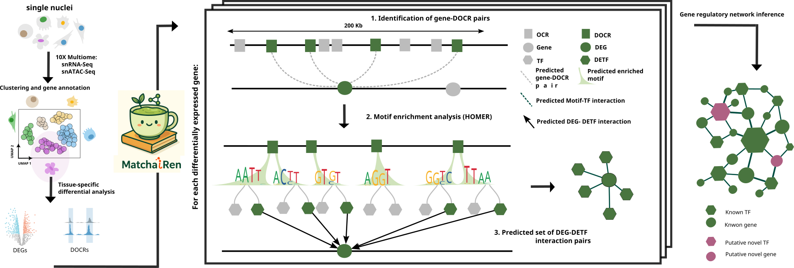

# MatchaiRen  
**Reconstruction of Cell-Type Specific Gene Regulatory Networks**

MatchaiRen is a Snakemake pipeline that integrates differential gene expression and
chromatin accessibility data to score transcription factor regulatory networks.

The pipeline combines transcription factor motifs from human and mouse with
ortholog mapping to enable cross-species regulatory inference.

The entire pipeline is containerized with Docker to ensure reproducibility.

---

##  Requirements

- **Linux** (tested on Ubuntu 20.04+)
- **Docker** ≥ 20.x
- **At least 4 CPU cores** recommended for full execution

No local installation of conda, Snakemake, Python, or R is required.

---

##  Repository structure

```text
.
├── Snakefile
├── config.yaml
├── Dockerfile
├── environment.yaml
├── run_snakemake.sh
├── prepare_data.bash
├── run_motif_pipeline.sh
├── run_post_pipeline.sh
├── functions_motif_network.bash
├── parse_genes.R
├── network_scoring.R
├── search_peaks_within_genes.py
├── retrieve_DNA_seq.py
├── merge_tfs_degs.R
│
├── data/
│   ├── motifs/        # TF motif databases
│   ├── degs/          # differential gene expression files
│   └── docrs/         # differential chromatin accessibility (peaks)
│
├── reference/
│   ├── genomes/       # reference genome FASTA
│   ├── annotations/   # gene annotations (GTF/GFF)
│   └── orthologs/     # ortholog mappings
│
├── results/           # output directory (contains demo results)
│   └── retina/        # pre-computed demo dataset results
│       ├── network_final.tsv
│       ├── network_scored.txt
│       ├── coordinates.tsv
│       ├── expression.tsv
│       ├── degrees.txt
│       ├── forward/
│       └── reverse/
│
└── docs/
    ├── matchairen_logo.png
    └── matchairen_pipeline.png
    
    
    
## Input data
Users must provide and adapt the following inputs according to their organism and experimental setup.

Reference data
Located in reference/:

Genome FASTA (reference/genomes/)

Gene annotations (reference/annotations/) in GTF/GFF format

Ortholog tables:

species ↔ human

species ↔ mouse
(reference/orthologs/)

Ortholog tables are required because TF motifs from both human and mouse are used in the analysis.

Experimental data
Located in data/:

Differentially expressed genes (data/degs/) - tab-separated files with gene IDs, log2FC, and adjusted p-values

Differentially accessible chromatin regions (data/docrs/) - peak coordinates with differential accessibility

TF motif databases (data/motifs/) - position weight matrices (PWMs) for transcription factors

## Configuration
All file paths and analysis parameters are defined in:

text
config.yaml
Users must edit this file to:

Specify the organism (e.g., Danio_rerio, Homo_sapiens, Mus_musculus)

Choose cell types and strands to analyze (forward/reverse)

Point to the correct input files (genome, annotations, orthologs)

Adjust analysis parameters (log2FC thresholds, adjusted p-value cutoffs)

Changing values in config.yaml will automatically trigger the appropriate Snakemake rules.

Advanced parameters
For finer control, prepare_data.bash contains parameters for:

Upstream/downstream interval around genes (default ±100kb)

Filtering thresholds (log2FC, adjusted p-value)

Peak-to-gene assignment parameters

These can be modified directly inside the script if needed.

## Running the pipeline with Docker
All commands must be executed from the root of the repository.

1. Build the Docker image
bash
docker build -t matchairen-homer:latest .
2. Default execution (shows demo results)
By default, the container displays the pre-computed demo results:

bash
docker run --rm -it matchairen-homer:latest
This will show you the contents of /work/results/retina/ with the key output files.

3. Interactive execution for exploration
Enter an interactive shell inside the container:

bash
docker run --rm -it --entrypoint bash matchairen-homer:latest
Inside the container:

bash
# Activate the conda environment
conda activate GRN_software

# Explore the results
cd /work/results/retina/
ls -la

# View network files
head network_final.tsv

# Modify scripts if needed (e.g., prepare_data.bash)
# vi /work/prepare_data.bash

# Run the pipeline manually
cd /work
snakemake --cores 4
4. Full pipeline execution (generate new results)
To execute the complete pipeline with your own parameters:

bash
# First, edit config.yaml with your settings
nano config.yaml

# Run the pipeline
docker run --rm -it \
  -v $(pwd):/work \
  matchairen-homer:latest
5. Saving results to your host machine
Because changes inside the container are ephemeral, you need to copy results to your host:

Method A: Using docker cp (for running containers)
bash
# Run the container in the background
docker run -d --name matchairen_run matchairen-homer:latest

# Copy results
docker cp matchairen_run:/work/results/retina ./my_results

# Clean up
docker rm matchairen_run
Method B: Using a volume mount (recommended for multiple runs)
bash
# Create a directory for results
mkdir -p ~/matchairen_results

# Run with mounted volume
docker run --rm -it \
  -v ~/matchairen_results:/work/results/host_output \
  matchairen-homer:latest

# Results will appear in ~/matchairen_results/
Method C: Manual copy from interactive session
bash
# Start interactive session
docker run --rm -it --entrypoint bash matchairen-homer:latest

# Inside container:
conda activate GRN_software
cd /work

# Find container ID (in another terminal)
docker ps

# Copy results (in another terminal)
docker cp <container_id>:/work/results/retina ./results_retina_test
6. Quick result extraction (simplest method)
For reviewers who just want the results on their machine:

bash
# One-liner to copy demo results to host
mkdir -p ~/matchairen_results
docker run --rm -v ~/matchairen_results:/output --entrypoint bash matchairen-homer:latest -c "cp -r /work/results/retina/* /output/ && echo '✅ Results copied to ~/matchairen_results/'"

# Verify
ls -la ~/matchairen_results/
## Output
All results are written to the results/ directory with the following structure:

text
results/
└── [celltype]/
    ├── forward/
    │   ├── network_final.tsv        # TF-target network (forward strand)
    │   ├── TF_expression.tsv        # TF expression levels
    │   └── gene_expression.tsv      # Target gene expression
    ├── reverse/
    │   ├── network_final.tsv        # TF-target network (reverse strand)
    │   ├── TF_expression.tsv
    │   └── gene_expression.tsv
    ├── network_scored.txt           # Combined and scored network
    ├── coordinates.tsv              # Genomic coordinates
    ├── expression.tsv               # Combined expression matrix
    ├── degrees.txt                  # Network degree statistics
    ├── peaks_within_degs.tsv        # Peaks assigned to DEGs
    └── positive_genes.tsv           # Genes meeting thresholds

##Key output files
network_final.tsv: Contains TF-target gene relationships with scores

network_scored.txt: Final network with combined scores from both strands

degrees.txt: Node degree statistics for network analysis

## Demo dataset
The repository includes a pre-computed demo dataset:

Organism: Zebrafish (Danio rerio)

Data: Chromosome 1 only (for quick testing)

Tissue: Retina

Results: Pre-computed in results/retina/

This allows reviewers to inspect results immediately without running the full pipeline.

## Troubleshooting
Permission issues with mounted volumes
If you encounter permission errors when mounting volumes, try:

bash
docker run --rm -it \
  -u $(id -u):$(id -g) \
  -v $(pwd):/work \
  matchairen-homer:latest
Pipeline fails with missing files
Ensure all required input files are present in data/ and reference/ with correct paths in config.yaml.

"Nothing to be done" message
This is normal when results already exist. To force re-execution:

bash
# Remove results or modify config.yaml
rm -rf results/retina/
# Then run again
Out of memory
Reduce the number of cores or process smaller chromosomes first:

bash
snakemake --cores 2
Container exits immediately
If the container exits without showing results, run in interactive mode:

bash
docker run --rm -it --entrypoint bash matchairen-homer:latest
# Then manually: conda activate GRN_software && cd /work && ls -la results/retina/
## Notes
This pipeline does not download reference data automatically.

Users are responsible for preparing input files in the expected formats.

The pipeline has been tested on Linux systems using Docker.

For large genomes, ensure sufficient disk space (≥10GB recommended).

The demo dataset uses only chromosome 1 for quick testing.

Results are pre-computed in the Docker image for immediate inspection.

## Citation
If you use MatchaiRen in your research, please cite:

[Citation information to be added upon publication]

## Contact
For questions or issues, please open an issue on GitHub or contact the authors.

Version: 1.0.0
Last updated: March 2026
